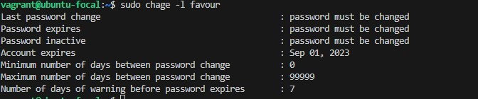

1. To add a new user called *favour*, I used `useradd favour`. To gain permission from the root I used `sudo`

2. To set an expiry date of 2 weeks for the user `favour`, I used `sudo chage -E <expiry date> <user>`. 

 <user>">

To confirm the expiry date I used `sudo chage -l favour`.

3. To prompt the user to change password on login, I used `sudo passwd -e favour`

To confirm the expiry date I used `sudo chage -l favour`.

4. To attach the user *favour* to a group called *altschool* I first created the group using `sudo groupadd altschool`

To confirm the group  exists, I used `sudo getent group`. 

The group *altschool* has been created. Now, to add *favour* to *altschool*, I used `sudo usermod -aG altschool favour`

Let's see if the group *altschool* now has a user called *favour*

5. To allow altschool group to be able to run only cat command on /etc/, I set up an access control using `sudoers` file and opened using `sudo visudo`

and then added the command `%altschool ALL=(ALL) /bin/cat /etc/*` for the group to run cat command on /etc/

6. To create another user `fave`and make sure that this user doesn't have a home directory i used `useradd -M fave`
